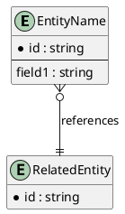

Project Entities Registry (DDT)
===============================

Full List
---------

| Entity ID | Entity Name | Package | Package Role (Core/Column/Complementary) | Source FR/UC | Diagram Ref | Owner | Status |
|-----------|-------------|---------|-------------------------------------------|--------------|-------------|-------|--------|
| ENT-XXX   | EntityName  | Package1 | Core                                     | FR-XXX, UC-XXX | Package1/Entities.md | Name | Draft |
| ...       | ...         | ...     | ...                                       | ...          | ...         | ...   | ...    |

---

Package Mapping Template
------------------------

| Entity ID | Package | Role in Package | Notes |
|-----------|---------|-----------------|-------|
| ENT-XXX   | Package1 | Core / Column / Complementary | |

---

DDT Attribute Template
----------------------

| Entity Name | Attribute/Column Name | Key (PK/FK/-) | Data Type | Not Null (Y/N) | Length | FK Table | Description |
|-------------|------------------------|---------------|-----------|----------------|--------|----------|-------------|
| EntityName  | id                     | PK            | UUID      | Y              | 36     | -        | Primary identifier |
| EntityName  | related_id             | FK            | UUID      | Y              | 36     | RelatedEntity | Foreign key to related entity |

---

Aggregate PlantUML (Optional)
-----------------------------

