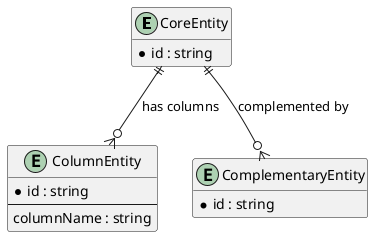

Package3 Entities (DDT)
=======================

Entity Classification
---------------------

| Entity ID | Entity Name | Package Role (Core/Column/Complementary) | Source FR/UC | Owner | Status |
|-----------|-------------|-------------------------------------------|--------------|-------|--------|
| ENT-P3-001 |             | Core                                      |              |       | Draft  |
| ENT-P3-002 |             | Column                                    |              |       | Draft  |
| ENT-P3-003 |             | Complementary                             |              |       | Draft  |

DDT (Attribute/Column Level)
----------------------------

| Entity Name | Attribute/Column Name | Key (PK/FK/-) | Data Type | Not Null (Y/N) | Length | FK Table | Description |
|-------------|------------------------|---------------|-----------|----------------|--------|----------|-------------|
|             |                        |               |           |                |        |          |             |

Relationship Notes
------------------
- Core entities drive package behavior and scenarios.
- Column entities represent data structures that are primarily attribute-focused in this package.
- Complementary entities support enrichment, integration, or reporting.
- DDT rows define attribute-level metadata (key type, datatype, nullability, length, FK table, description).

PlantUML
--------

